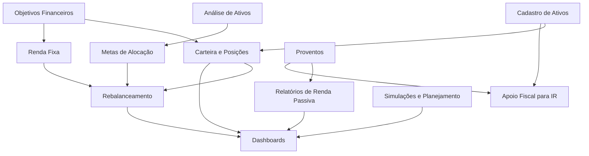

# Arquitetura Funcional

Este documento descreve a arquitetura funcional sugerida a partir da planilha. A intenção não é definir tecnologia, mas organizar os conceitos de negócio que a aplicação deve representar.

## Domínios funcionais

### Cadastro de ativos

Responsável por centralizar informações dos ativos financeiros.

Origem principal na planilha:

- `DB Ativos`
- `Análise de ações etf br`
- `Análise etf`
- `Análise de fundos`

Conceitos envolvidos:

- Ativo.
- Tipo de ativo.
- Nome.
- Ticker.
- Cotação.
- Moeda.
- Custódia.
- Indicador de posse.
- Dados fiscais.
- Fontes externas de consulta.

### Carteira e posições

Responsável por representar o que existe atualmente em carteira.

Origem principal na planilha:

- `Ações`
- `Fundos`
- `Internacional`
- `Bitcoin`
- `Renda Fixa`
- `Previdência`
- `AUPO11AREA11`

Conceitos envolvidos:

- Posição.
- Quantidade.
- Preço médio.
- Valor aplicado.
- Valor atual.
- Valorização.
- Retorno total.
- Percentual atual da carteira.
- Percentual desejado.
- Valor faltante.
- Recomendação de compra ou rebalanceamento.

### Objetivos financeiros

Responsável por permitir que parte de um investimento seja associada a uma finalidade específica.

Origem principal na planilha:

- `AUPO11AREA11`

Conceitos envolvidos:

- Objetivo.
- Ativo vinculado ao objetivo.
- Quantidade individual.
- Quantidade total do ativo.
- Valor aplicado no objetivo.
- Valor atual do objetivo.
- Percentual de alocação dentro do ativo.

Esse domínio é importante porque `AUPO11AREA11` representa ETFs de renda fixa usados como caixinhas. O ativo tem natureza de ETF e de renda fixa ao mesmo tempo, mas a aplicação também precisa enxergar sua finalidade prática. Para carteira e rebalanceamento, esses valores continuam compondo a classe de renda fixa.

### Rebalanceamento

Responsável por comparar a carteira atual com a alocação desejada.

Origem principal na planilha:

- `BALANCEAMENTO`
- Carteiras de posição.
- Análises de alocação.

Conceitos envolvidos:

- Classe de ativo.
- Percentual alvo.
- Valor alvo.
- Valor atual.
- Diferença.
- Valor necessário para atingir o alvo.
- Cotação de apoio, como dólar e bitcoin.

Regra específica: investimentos controlados por objetivos, como `AUPO11AREA11`, não devem ficar fora do rebalanceamento. Eles precisam entrar na composição da classe `Renda Fixa`, mesmo que a experiência de cadastro permita dividir o ativo por objetivo.

### Proventos e renda passiva

Responsável por registrar, consolidar e analisar proventos.

Origem principal na planilha:

- `DB Proventos`
- `DB Proventos internacional`
- `Proventos Cálculos`
- `Proventos Cálculos internaciona`
- `RESUMO`

Conceitos envolvidos:

- Provento.
- Ativo.
- Tipo de provento.
- Data.
- Valor.
- Mês.
- Ano.
- Classe do ativo.
- Total mensal.
- Total anual.
- Total por classe.

### Apoio fiscal para Imposto de Renda

Responsável por guardar informações necessárias para conferência e declaração de IR.

Origem principal na planilha:

- `DB Ativos`
- `DB Proventos`
- `DB Proventos internacional`

Conceitos envolvidos:

- CNPJ do ativo, empresa ou fundo.
- CNPJ da fonte pagadora.
- Nome da fonte pagadora.
- Custódia.
- Proventos por ativo e ano.
- Informações para informe de rendimentos.

O modelo deve permitir que o CNPJ do ativo ou fundo seja diferente do CNPJ da fonte pagadora do dividendo. Esse comportamento é uma regra de negócio relevante, não apenas um detalhe cadastral.

### Análise de ativos

Responsável por avaliar ativos e definir critérios de elegibilidade ou prioridade.

Origem principal na planilha:

- `Análise de açõesetf br`
- `Análise etf`
- `Análise de fundos`
- `DIAGRAMA AÇÕES`
- `DIAGRAMA FIIS`
- `Perguntas`

Conceitos envolvidos:

- Critério.
- Pergunta.
- Resposta.
- Pontuação.
- Peso.
- Fator.
- Score.
- Viabilidade.
- Percentual desejado.
- Preço teto ou valor máximo.

### Simulações e planejamento

Responsável por projetar cenários futuros.

Origem principal na planilha:

- `Simulação de dividendos`
- `PATRIMÔNIO TOTAL`
- `Previdência`

Conceitos envolvidos:

- Capital inicial.
- Aporte mensal.
- Aporte extra.
- Saque.
- Valorização mensal e anual.
- Reajuste de aporte.
- Renda projetada.
- Patrimônio projetado.
- Evolução anual.

### Dashboards e relatórios

Responsável por apresentar consolidações.

Origem principal na planilha:

- `RESUMO`
- `BALANCEAMENTO`
- `PATRIMÔNIO TOTAL`
- `Proventos Cálculos`
- `Proventos Cálculos internaciona`

Conceitos envolvidos:

- Patrimônio total.
- Alocação por classe.
- Evolução anual.
- Proventos por mês.
- Proventos por classe.
- Aderência ao balanceamento.
- Projeções.

## Entidades conceituais iniciais

Estas entidades são conceituais e não representam ainda tabelas ou classes técnicas.

### Ativo

Representa qualquer instrumento financeiro controlado.

Campos candidatos:

- Ticker ou identificador.
- Nome.
- Tipo.
- Classe.
- Moeda.
- Cotação atual.
- Indicador de posse.
- Custódia.
- Dados fiscais.

### Posição

Representa a quantidade e o valor de um ativo em carteira.

Campos candidatos:

- Ativo.
- Quantidade.
- Preço médio.
- Valor aplicado.
- Valor atual.
- Retorno.
- Percentual da carteira.

### Objetivo

Representa uma finalidade financeira vinculada a um ativo ou conjunto de ativos.

Campos candidatos:

- Nome do objetivo.
- Ativo vinculado.
- Quantidade associada.
- Valor aplicado.
- Valor atual.
- Percentual de alocação.
- Observações.

### Provento

Representa um rendimento recebido ou registrado.

Campos candidatos:

- Ativo.
- Tipo de provento.
- Data.
- Valor.
- Moeda.
- Mês.
- Ano.
- Fonte pagadora.
- Dados fiscais associados.

### Critério de análise

Representa uma pergunta ou regra usada para avaliar um ativo.

Campos candidatos:

- Nome do critério.
- Pergunta.
- Tipo de ativo aplicável.
- Peso.
- Resposta.
- Pontuação.

### Meta de alocação

Representa o percentual desejado por classe, ativo ou estratégia.

Campos candidatos:

- Escopo da meta.
- Percentual desejado.
- Valor alvo.
- Valor atual.
- Diferença.

## Fluxo funcional consolidado

## Regras funcionais observadas

- Um ativo pode existir no cadastro mesmo que ainda não esteja em posse.
- Uma posição depende de quantidade e preço médio, enquanto o valor atual depende da cotação.
- Uma classe de ativo pode ter percentual desejado e valor alvo.
- Um ativo pode ser analisado por critérios diferentes conforme seu tipo.
- Proventos devem ser vinculados a ativo, data, tipo e fonte pagadora.
- Dados fiscais de ativo e fonte pagadora precisam coexistir, pois podem divergir.
- Um ETF de renda fixa pode ser tratado simultaneamente como ativo, renda fixa e objetivo financeiro.
- Objetivos vinculados a ETFs de renda fixa devem ser exibidos junto da renda fixa e considerados no rebalanceamento dessa classe.
- Dashboards devem ser derivados de dados e cálculos, não preenchidos manualmente.

## Separação desejada para a aplicação

Na planilha, uma mesma aba pode conter dados, regras e visualização. Na aplicação, a separação conceitual deve ser:

- Cadastros: ativos, fontes pagadoras, custódias, critérios.
- Lançamentos: posições, proventos, taxas, aportes.
- Regras: cálculo de retorno, balanceamento, simulações, pontuações.
- Relatórios: resumo, evolução patrimonial, proventos e IR.
- Planejamento: metas, objetivos e projeções.

