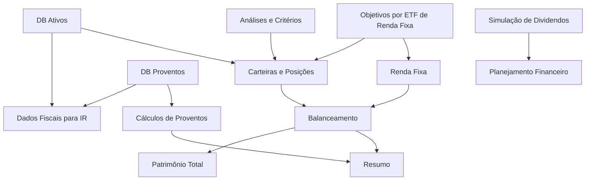

# Visão Geral da Planilha

A planilha `Investimento_controle.xlsx` centraliza controle patrimonial, carteira por classe de ativo, análise de ativos, proventos, simulações e informações de apoio à declaração de Imposto de Renda.

Foram identificadas 23 abas. Elas não representam apenas telas: algumas são bases de dados, outras são cálculos intermediários e outras são dashboards consolidados.

## Grupos funcionais

### Dashboards e consolidações

- `RESUMO`: visão consolidada de proventos, divisão da carteira e totais.
- `BALANCEAMENTO`: compara alocação desejada contra alocação atual e calcula faltas por classe.
- `PATRIMÔNIO TOTAL`: acompanha evolução anual do patrimônio em reais, dólar, cripto e total.

### Carteiras e posições

- `Ações`: posição atual de ações e ETFs brasileiros.
- `Fundos`: posição atual de fundos imobiliários.
- `Internacional`: posição atual de ETFs internacionais.
- `Bitcoin`: posição atual em BTC.
- `Renda Fixa`: posição atual em CDB, LCI, ETFs de renda fixa e aplicações similares. Inclui, para fins de carteira e rebalanceamento, os ETFs controlados por objetivo em `AUPO11AREA11`.
- `Previdência`: planejamento e acompanhamento de previdência.

### Investimentos híbridos e objetivos

- `AUPO11AREA11`: controla ETFs de renda fixa com divisão por objetivos. É um caso especial porque a aba existe por facilidade e limitação da planilha: na aplicação, espera-se uma funcionalidade flexível de objetivos vinculados a ativos, sem deixar de exibir esses valores junto da renda fixa no rebalanceamento.

### Bases e cadastros

- `DB Ativos`: cadastro mestre de ativos, cotações, tipo, posse, CNPJ, custódia e fonte de acesso.
- `DB Proventos`: base de proventos nacionais.
- `DB Proventos internacional`: base de proventos internacionais.
- `Bitcoin taxas`: base de taxas e movimentações associadas a compras e transferências de BTC.

### Análises e critérios

- `Análise de açõesetf br`: avaliação de ações e ETFs brasileiros, incluindo critérios, pesos, viabilidade e percentual desejado.
- `Análise etf`: planejamento de alocação de ETFs internacionais.
- `Análise de fundos`: avaliação e alocação desejada de fundos imobiliários.
- `DIAGRAMA AÇÕES`: matriz de perguntas e pontuação para ações.
- `DIAGRAMA FIIS`: matriz de perguntas e pontuação para FIIs.
- `Perguntas`: catálogo das perguntas usadas nas análises.

### Cálculos e simulações

- `Proventos Cálculos`: consolidação mensal e anual de proventos nacionais.
- `Proventos Cálculos internaciona`: consolidação mensal e anual de proventos internacionais.
- `Simulação de dividendos`: simulação de crescimento patrimonial e renda futura.

## Fluxo principal

## Leituras importantes para a aplicação

A planilha mistura quatro tipos de responsabilidade:

- Entrada manual: posições, quantidades, preços médios, objetivos, taxas, dados fiscais e premissas.
- Base auxiliar: cadastro de ativos, cotações, vínculos fiscais, perguntas e critérios.
- Cálculo: balanceamento, retorno, proventos, valorização, simulações e projeções.
- Visualização: resumo, evolução patrimonial, divisão da carteira e relatórios.

Na aplicação, essas responsabilidades devem ser separadas para evitar que a lógica fique presa ao formato de abas e células.

## Apoio fiscal

Os campos de CNPJ da empresa/fundo, CNPJ da fonte pagadora, fonte pagadora e custódia têm finalidade prática para declaração de Imposto de Renda. O modelo futuro deve permitir que um ativo tenha seus próprios dados fiscais e que cada provento tenha uma fonte pagadora potencialmente diferente.

Isso é especialmente importante para fundos e proventos, porque o CNPJ do fundo ou empresa nem sempre é o mesmo CNPJ usado pela fonte pagadora no informe de rendimentos.

## Pontos de atenção

- Algumas abas têm nomes com acentuação ou truncamento, como `Proventos Cálculos internaciona`; a documentação mantém o nome da planilha, mas a aplicação pode usar nomes normalizados.
- A aba `AUPO11AREA11` não deve ser tratada como uma simples aba auxiliar. Ela sugere uma funcionalidade de objetivos financeiros vinculados a investimentos, mas seus ativos continuam compondo a estratégia de renda fixa para carteira e rebalanceamento.
- `DB Proventos` concentra grande volume de fórmulas e dados, então deve ser analisada como base transacional de proventos, não como relatório.
- `RESUMO`, `BALANCEAMENTO` e `PATRIMÔNIO TOTAL` são fortes candidatos a dashboards.
