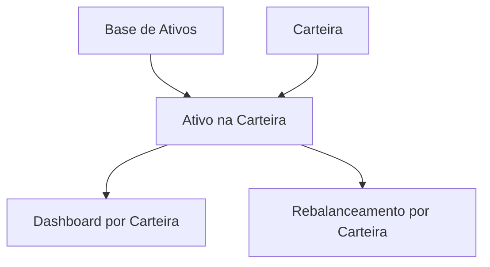

# Cadastro de Ativos e Carteiras

Esta área foi desmembrada em três funcionalidades distintas:

- [Cadastro de ativos no banco de dados](cadastro-ativos-banco-de-dados.md)
- [Criação de carteira](criacao-de-carteira.md)
- [Cadastro de ativos na carteira](cadastro-ativos-na-carteira.md)
- [Cadastro unificado de renda fixa e previdência na carteira](cadastro-rf-previdencia-na-carteira.md)

> Renda fixa tradicional (CDB, LCI, LCA, Tesouro Selic etc.) e previdência privada
> têm cadastro **unificado** direto na carteira: produto e posição são criados numa
> única ação. Esses produtos **não** ficam na base global (`/assets`). ETFs de renda
> fixa (ex.: `AUPO11`) seguem como ativos de mercado em `/assets`. Ver doc acima.

## Visão geral

A aplicação deve separar dados globais do ativo, dados da carteira e dados da posição.

Essa separação evita copiar a estrutura da planilha e permite controlar carteiras de pessoas diferentes ou com objetivos diferentes no mesmo aplicativo.

## 1. Cadastro de ativos no banco de dados

Registra ou importa informações gerais do ativo.

Exemplos:

- Ticker.
- Nome.
- Tipo.
- Local.
- País.
- Moeda.
- Setor.
- CNPJ.
- Fonte de cotação.
- Classificação do ETF nacional.

Esse cadastro pode ser preenchido por APIs de terceiros sempre que possível.

Um ativo cadastrado na base não significa que ele está em uma carteira.

## 2. Criação de carteira

Permite criar agrupamentos independentes de posições.

Exemplos:

- Carteira pessoal.
- Carteira de outra pessoa.
- Carteira de aposentadoria.
- Carteira de reserva de emergência.
- Carteira com objetivo específico.

Cada carteira pode ter metas, posições e visão de dashboard próprias.

## 3. Cadastro de ativos na carteira

Vincula um ativo da base a uma carteira específica.

Exemplos de dados da posição:

- Quantidade.
- Preço médio.
- Custódia.
- Data de entrada.
- Objetivo vinculado.
- Observações pessoais.

O mesmo ativo pode aparecer em várias carteiras com posições diferentes.

## Relação entre as funcionalidades

## Regra principal

A classificação do ativo nasce no cadastro da base de dados. A carteira apenas usa essa classificação.

Exemplo:

- `AUPO11` cadastrado como ETF nacional de renda fixa.
- Ao adicionar `AUPO11` a qualquer carteira, ele aparece como renda fixa.
- Se estiver vinculado a um objetivo, continua compondo renda fixa no dashboard e no rebalanceamento.

## Impacto no dashboard

O dashboard inicial deve permitir selecionar a carteira ativa, por exemplo com um dropdown.

Ao trocar a carteira selecionada, a aplicação deve recalcular:

- Patrimônio total.
- Alocação por classe.
- Proventos.
- Evolução patrimonial.
- Rebalanceamento.

Uma visão consolidada de múltiplas carteiras pode existir futuramente, mas a visão por carteira deve ser a base do funcionamento.
# Cadastro de Ativos

## Objetivo

Centralizar os ativos acompanhados pela aplicação, estejam ou não em carteira, garantindo que cada ativo tenha classificação correta, dados fiscais, origem geográfica e informações suficientes para alimentar carteira, rebalanceamento, proventos, objetivos e relatórios.

O cadastro não deve copiar a estrutura da planilha. A planilha serve como referência para identificar os dados existentes, mas a aplicação deve organizar o cadastro por fluxo guiado e campos específicos conforme o tipo de ativo.

Há dois cadastros conceituais para ativos de **bolsa** (ação, ETF, FII, cripto etc.):

- Cadastro na base de dados (`/assets`): registra ou importa as informações gerais do ativo.
- Cadastro na carteira (`/portfolios`): registra que o usuário possui aquele ativo e informa dados da posição, como quantidade, preço médio, custódia e objetivos.

Um ativo de bolsa pode existir na base de dados sem estar na carteira.

Para **renda fixa tradicional** (CDB, LCI, LCA, Tesouro Selic etc.) e **previdência privada**, o produto e a posição são cadastrados **juntos** na carteira, numa única ação — não passam por `/assets`. Ver [Cadastro unificado de renda fixa e previdência na carteira](cadastro-rf-previdencia-na-carteira.md).

## Referências na planilha

- `DB Ativos`: cadastro mestre de ativos, cotações, dados fiscais, custódia e links.
- `Análise de açõesetf br`: dados complementares de ações e ETFs brasileiros.
- `Análise etf`: ETFs internacionais e percentuais desejados.
- `Análise de fundos`: fundos imobiliários, segmentos e preço teto.
- `AUPO11AREA11`: exemplo de ETF brasileiro de renda fixa usado por objetivo.

## Perguntas que a funcionalidade deve responder

- Que tipo de ativo estou cadastrando?
- Esse ativo é nacional ou internacional?
- Se for internacional, de qual país ele é?
- Quais campos específicos são necessários para esse tipo de ativo?
- Esse ativo possui dados fiscais relevantes para IR?
- A cotação desse ativo será fixa, manual ou obtida de fonte pública?
- Se for ETF nacional, ele representa renda variável ou renda fixa?
- Em qual classe esse ativo deve aparecer na carteira e no rebalanceamento?
- Esse ativo será apenas salvo na base ou também será adicionado à carteira?
- Quais dados podem ser preenchidos automaticamente por API de terceiros?

## Fluxo de cadastro

### 1. Buscar ou cadastrar na base de dados

O primeiro passo deve ser localizar o ativo na base da aplicação.

Formas esperadas:

- Buscar por ticker, nome ou identificador.
- Consultar API de terceiros para preencher dados automaticamente.
- Cadastrar manualmente quando a API não retornar o ativo ou quando faltarem dados.

Dados que podem vir de API de terceiros:

- Nome do ativo.
- Ticker ou identificador.
- Tipo do ativo.
- Mercado.
- País.
- Moeda.
- Setor, subsetor ou segmento.
- CNPJ, quando disponível.
- Cotação atual.
- Fonte de cotação.

O usuário deve revisar e complementar apenas o que não vier preenchido ou o que exigir decisão própria, como custódia pessoal, posse em carteira e classificação específica quando houver ambiguidade.

### 2. Escolher o tipo do ativo

Tipos iniciais sugeridos:

- Ação.
- ETF.
- Fundo imobiliário.
- Renda fixa.
- Criptoativo.
- Previdência.
- Outro.

Essa escolha define quais campos específicos serão exibidos nas próximas etapas.

### 3. Escolher local

O usuário deve indicar se o ativo é:

- Nacional.
- Internacional.

Se for internacional, o usuário deve selecionar o país do ativo.

O local influencia moeda, regras de cotação, dados fiscais e relatórios.

### 4. Preencher dados específicos

Cada combinação de tipo e local deve exibir campos adequados.

Exemplos:

- Ação nacional: ticker, nome, setor, subsetor, segmento, CNPJ, custódia e fonte pagadora quando aplicável.
- ETF nacional: ticker, nome, subtipo do ETF, CNPJ, custódia e fonte pagadora quando aplicável.
- ETF internacional: ticker, nome, país, moeda, mercado e fonte de cotação.
- Fundo imobiliário: ticker, nome, segmento, tipo, CNPJ do fundo, CNPJ da fonte pagadora e custódia.
- Renda fixa: identificador (editável; botão **Gerar identificador** monta «tipo de título + indexador + ano do vencimento» após preencher tipo de título, indexador e data de vencimento), descrição do produto, tipo de título (CDB, LCI, Tesouro etc. ou «Outro»), indexador (Pré-fixado, IPCA+, Pós fixado), rentabilidade em texto livre, datas de vencimento e de compra, emissor/fonte pagadora e observações.
- Criptoativo: símbolo, nome, rede ou corretora/custódia quando aplicável.
- Previdência: instituição, plano, tipo e informações gerais de acompanhamento.

Para renda fixa tradicional (CDB, LCI, LCA, Tesouro Selic etc.) e previdência privada, o cadastro do produto e o cadastro da posição acontecem **juntos**, numa única tela na carteira (`/portfolios`). Os campos `Valor aplicado` e `Valor atual` pertencem à posição (variam por aplicação do usuário), enquanto identificador, descrição, tipo de título, indexador e datas descrevem o produto. Ver [Cadastro unificado de renda fixa e previdência na carteira](cadastro-rf-previdencia-na-carteira.md). Esses produtos não são cadastrados nem listados na base global `/assets`.

### 5. Definir subtipo de ETF nacional

Quando o usuário escolher `ETF` e `Nacional`, deve aparecer uma pergunta adicional:

> Qual é o tipo do ETF?

Opções:

- Renda variável.
- Renda fixa.

Essa escolha é fundamental para a aplicação classificar o ativo corretamente:

- ETF nacional de renda variável deve aparecer junto de ações/ETFs BR na carteira e no rebalanceamento.
- ETF nacional de renda fixa deve aparecer junto de renda fixa na carteira e no rebalanceamento.
- ETF nacional de renda fixa também pode ser usado em objetivos financeiros/caixinhas.

Exemplo: ativos hoje controlados em `AUPO11AREA11` devem ser cadastrados como ETFs nacionais de renda fixa. A funcionalidade de objetivos usa essa classificação, mas não muda a classe do ativo.

### 6. Adicionar ou não à carteira

Depois de existir na base de dados, o ativo de **bolsa** pode ser adicionado à carteira.

Se o usuário adicionar à carteira, devem ser solicitados dados da posição:

- Quantidade.
- Preço médio.
- Data de início ou data de compra, quando aplicável.
- Custódia do usuário.
- Observações pessoais.
- Objetivo vinculado, quando aplicável.

Para **renda fixa tradicional e previdência privada** o fluxo é diferente: o produto
e a posição são cadastrados **juntos** na carteira, numa única tela (modal
**Adicionar ativo à carteira** em `/portfolios`). Nesse caso, além dos dados do
produto, informam-se os campos manuais da posição:

- Valor aplicado.
- Valor atual, atualizado manualmente quando não houver cotação automática.
- Rendimento contratado: para renda fixa vem do campo único **Rentabilidade**; texto livre (ex.: `100% CDI`, `IPCA + 8,40% a.a.`, `Selic`).

Ver [Cadastro unificado de renda fixa e previdência na carteira](cadastro-rf-previdencia-na-carteira.md).

Se o usuário não adicionar à carteira, o ativo de bolsa permanece disponível na base para análise, acompanhamento, simulações ou uso futuro.

## Dados principais

Campos comuns:

- Nome.
- Identificador ou ticker.
- Tipo do ativo.
- Local: nacional ou internacional.
- País, quando internacional.
- Moeda.
- Classe de exibição na carteira.
- Observações.

Campos de carteira:

- Indicador se está em posse.
- Quantidade.
- Preço médio.
- Custódia do usuário.
- Objetivo vinculado, quando aplicável.
- Observações pessoais da posição.

Campos fiscais:

- CNPJ da empresa, fundo ou emissor.
- CNPJ da fonte pagadora.
- Nome da fonte pagadora.
- Dados auxiliares para declaração de IR.

O cadastro deve permitir que o CNPJ do ativo e o CNPJ da fonte pagadora sejam diferentes.

## Cotação

A cotação deve ser tratada como uma informação atualizável, não como um campo estático da planilha.

Estratégias esperadas:

- Buscar cotação via integração/hook com uma aplicação pública ou fonte pública de dados.
- Permitir atualização automática a cada período configurável.
- Permitir atualização manual por botão em uma visão de carteira ou detalhe do ativo.
- Permitir cotação fixa ou manual quando não houver fonte pública adequada.

O botão de atualização não precisa estar no cadastro. Ele faz mais sentido na carteira, no detalhe do ativo ou em uma rotina de atualização de cotações.

## Persistência

Todas as informações do cadastro devem ser salvas em banco de dados a ser definido futuramente.

Neste momento, a documentação não define tecnologia, modelo físico, ORM ou estrutura de tabelas. O importante é registrar que a base de ativos é fonte oficial para classificação e dados gerais, enquanto a carteira registra as posições do usuário.

## Base de dados vs carteira

### Base de dados de ativos

Contém informações gerais e reutilizáveis sobre ativos.

Pode ser alimentada por:

- API de terceiros.
- Importação futura.
- Cadastro manual.
- Correção manual de dados incompletos.

Exemplos de dados:

- Ticker.
- Nome.
- Tipo.
- Local.
- País.
- Moeda.
- Setor.
- CNPJ.
- Fonte de cotação.
- Classificação do ETF nacional.

### Carteira do usuário

Contém informações pessoais da posição do usuário.

Deve ser preenchida quando o usuário decidir acompanhar ou possuir o ativo.

Exemplos de dados:

- Quantidade.
- Preço médio.
- Custódia.
- Objetivo financeiro.
- Data de entrada.
- Observações pessoais.

Essa separação evita obrigar o usuário a preencher manualmente dados públicos e evita misturar dados globais do ativo com dados pessoais da carteira.

## Impacto em outros módulos

### Carteira

A carteira deve usar a classificação definida no cadastro para exibir o ativo na classe correta.

Exemplos:

- ETF nacional de renda variável aparece em ações/ETFs BR.
- ETF nacional de renda fixa aparece em renda fixa.
- ETF internacional aparece na carteira internacional.

### Rebalanceamento

O rebalanceamento deve usar a classe derivada do cadastro.

Exemplo: se `AUPO11` for cadastrado como ETF nacional de renda fixa, seu valor deve somar na classe `Renda Fixa`.

### Objetivos financeiros

Objetivos financeiros podem se vincular a ativos cadastrados.

No caso de ETF nacional de renda fixa, o ativo pode ser usado em caixinhas, mas continua sendo exibido como renda fixa na carteira e no rebalanceamento.

### Proventos e IR

Proventos devem usar os dados fiscais do cadastro do ativo e também permitir fonte pagadora específica por lançamento quando necessário.

## Regras funcionais

- Todo ativo deve ter um tipo.
- Todo ativo deve ter local nacional ou internacional.
- Ativo internacional deve ter país.
- ETF nacional deve ter subtipo: renda variável ou renda fixa.
- A classificação escolhida no cadastro determina onde o ativo aparece na carteira.
- Um ativo pode existir na base sem estar na carteira.
- Dados públicos do ativo devem ser preenchidos por API de terceiros sempre que possível.
- Dados pessoais da posição pertencem ao cadastro na carteira, não à base global do ativo.
- O cadastro fiscal deve aceitar diferença entre CNPJ do ativo e CNPJ da fonte pagadora.
- Cotação pode vir de fonte pública, rotina automática, atualização manual ou valor fixo/manual.
- Dados cadastrados devem ser persistidos em banco de dados a ser definido.

## Fora de escopo inicial

- Escolha do banco de dados.
- Escolha da API pública de cotações.
- Escolha das APIs de dados cadastrais de ativos.
- Implementação do hook de atualização.
- Tela final de atualização de cotações.
- Integração automática com corretoras.
- Validação oficial de CNPJ em fontes governamentais.

## Critérios de aceite

- O usuário consegue cadastrar um ativo escolhendo tipo, local e país quando aplicável.
- O usuário consegue buscar um ativo em uma fonte externa antes de preencher manualmente.
- O usuário vê campos específicos de acordo com tipo e local escolhidos.
- Ao escolher ETF nacional, o usuário precisa informar se é renda variável ou renda fixa.
- O usuário consegue salvar um ativo apenas na base sem adicioná-lo à carteira.
- O usuário consegue adicionar um ativo da base à carteira informando dados da posição.
- Um ETF nacional de renda fixa aparece como renda fixa nos módulos de carteira e rebalanceamento.
- Um ETF nacional de renda fixa pode ser vinculado a objetivos financeiros sem deixar de ser renda fixa.
- O cadastro permite armazenar CNPJ do ativo e CNPJ da fonte pagadora separadamente.
- A documentação deixa claro que cotação será obtida/atualizada por mecanismo externo ou manual, não digitada como dado central do cadastro.
