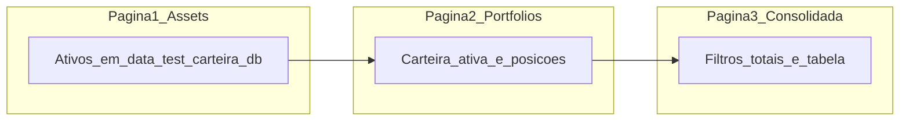

# Dependências entre casos de uso E2E (UI)

Ordem de execução documentada e estado compartilhado entre páginas. Os specs Playwright são autocontidos por arquivo (`beforeEach` com seed via API).

**Estratégia E2E:** ver [`estrategia-e2e-ui.md`](estrategia-e2e-ui.md) — projeto `ui`, lookup **yfinance**, comando `npm run test:ui`.

## Ambiente de teste

O Playwright sobe backend e frontend com bases **isoladas** do desenvolvimento local.

| Recurso | Valor na suíte E2E |
| ------- | ------------------ |
| Base de ativos | `backend/data/test/carteira.db` |
| Base de carteiras | `backend/data/test/portfolios.db` |
| Recriação dos bancos | `e2e/scripts/reset-test-db.js` (via `pretest:ui`, **antes** do servidor subir) |
| Lookup de ativos | `yfinance` (`ASSET_LOOKUP_MODE=yfinance` no Playwright) |
| API | `http://127.0.0.1:8001` (porta dedicada; ver `e2e/test-env.js`) |
| Frontend | `http://127.0.0.1:5174` (`VITE_API_BASE_URL` aponta para a API de teste) |

**Não usar:** `backend/carteira.db`, `backend/seed/assets.json` (catálogo de dev), carteiras em `%LOCALAPPDATA%`, nem qualquer dado do ambiente de desenvolvimento. Cada spec cria o estado necessário via API no `beforeEach`.

Configuração: [`e2e/playwright.config.js`](../playwright.config.js).

## Cadeia de páginas (1 → 2 → 3)

| Etapa | Rota | O que fica pronto para a próxima | Dados mínimos sugeridos |
| ----- | ---- | -------------------------------- | ------------------------ |
| **1 — Assets** | `/assets` | Catálogo de ativos em `carteira.db` de teste | BRL: `BBSE3`, FII, ETF RF `AUVP11`, RF manual, previdência; USD: `VOO`, `BTC-USD` |
| **2 — Portfolios** | `/portfolios` | Carteira ativa com posições em `portfolios.db` | Carteira «E2E Principal»; posições mercado e manuais ligadas aos ativos da etapa 1 |
| **3 — Consolidada** | `/portfolios/consolidada` | Mesma carteira ativa, cotações e FX | Filtros, cartões BRL/USD, ícone `$` em USD, consolidado em reais |

## Estado compartilhado entre casos

1. **`globalSetup`** deixa ambas as bases **vazias** antes da primeira spec.
2. Cada spec em `e2e/specs/assets/`, `e2e/specs/portfolios/` e `e2e/specs/consolidada/` faz **seed via API** no `beforeEach` (autocontido; não depende da ordem entre arquivos).
3. Os `.md` em `ui/portfolios/` podem referenciar ativos típicos (`BBSE3`, RF manual, etc.) — o seed do spec cria o estado necessário.
4. Playwright: `workers: 1`, `fullyParallel: false`.

## Convenção de IDs

| Prefixo | Página | Exemplo |
| ------- | ------ | ------- |
| `UI-AST-` | `/assets` | `UI-AST-002` |
| `UI-PRT-` | `/portfolios` | `UI-PRT-005` |
| `UI-CNS-` | `/portfolios/consolidada` | `UI-CNS-007` |

## Mapa rápido de dependências entre pastas

| Pasta | Pré-requisito documentado no **Dado** |
| ----- | ------------------------------------- |
| [`ui/assets/`](ui/assets/README.md) | Base vazia ou estado de `UI-AST-*` anterior |
| [`ui/portfolios/`](ui/portfolios/README.md) | Seed API no spec (`seedPortfolios*`) |
| [`ui/consolidada/`](ui/consolidada/README.md) | Seed API no spec (`seedConsolidada*`) |

## Ordem sugerida de implementação (fase 2)

1. `e2e/specs/assets/*.spec.ts` (18)
2. `e2e/specs/portfolios/*.spec.ts` (20)
3. `e2e/specs/consolidada/*.spec.ts` (15)

Cada spec deve espelhar o ID e o arquivo `.md` correspondente em `casos-de-uso/ui/`.
