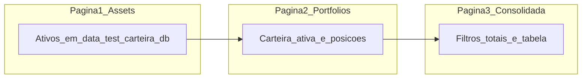

# Dependências entre casos de uso E2E (UI)

Ordem de execução documentada e estado compartilhado entre páginas. Os specs Playwright são autocontidos por arquivo (`beforeEach` com seed via API).

**Estratégia E2E:** ver [`estrategia-e2e-ui.md`](estrategia-e2e-ui.md) — projeto `ui`, lookup **yfinance**, comando `npm run test:ui`.

## Ambiente de teste

O Playwright sobe backend e frontend com bases **isoladas** do desenvolvimento local.

| Recurso | Valor na suíte E2E |
| ------- | ------------------ |
| Banco por worker | `backend/data/test/carteira-{N}.db` (N = índice do worker, 0–3) |
| Recriação dos bancos | `e2e/scripts/reset-test-db.js` (via `pretest:ui`, **antes** do servidor subir) |
| Lookup de ativos | `yfinance` (`ASSET_LOOKUP_MODE=yfinance` no Playwright) |
| API worker 0 | `http://127.0.0.1:8001` (workers seguintes: +1; ver `e2e/worker-env.js`) |
| Frontend worker 0 | `http://127.0.0.1:5174` (workers seguintes: +1) |
| Workers Playwright | **4** por padrão (`E2E_WORKERS`); `fullyParallel: true` entre arquivos |

**Não usar:** `backend/carteira.db`, `backend/seed/assets.json` (catálogo de dev), carteiras em `%LOCALAPPDATA%`, nem qualquer dado do ambiente de desenvolvimento. Cada spec cria o estado necessário via API no `beforeEach`.

Configuração: [`e2e/playwright.config.js`](../playwright.config.js).

## Cadeia de páginas (1 → 2 → 3)

| Etapa | Rota | O que fica pronto para a próxima | Dados mínimos sugeridos |
| ----- | ---- | -------------------------------- | ------------------------ |
| **1 — Assets** | `/assets` | Catálogo de ativos de **mercado** em `carteira.db` de teste | BRL: `BBSE3`, FII, ETF RF `AUVP11`; USD: `VOO`, `BTC-USD` (renda fixa tradicional e previdência **não** ficam aqui) |
| **2 — Portfolios** | `/portfolios` | Carteira ativa com posições no banco único | Carteira «E2E Principal»; posições de mercado ligadas aos ativos da etapa 1; renda fixa/previdência cadastradas direto no modal **Adicionar ativo à carteira** (produto + posição numa ação) |
| **3 — Consolidada** | `/portfolios/consolidada` | Mesma carteira ativa, cotações e FX | Filtros, cartões BRL/USD, ícone `$` em USD, consolidado em reais |

## Estado compartilhado entre casos

1. **`pretest:ui`** / reset deixa `carteira-{0..N-1}.db` **vazios** antes da primeira spec.
2. Cada spec faz **seed via API** no `beforeEach` (autocontido; não depende da ordem entre arquivos).
3. Os `.md` em `ui/portfolios/` podem referenciar ativos típicos (`BBSE3`, RF manual, etc.) — o seed do spec cria o estado necessário.
4. Playwright: **`workers: 4`** (default), **`fullyParallel: true`**; isolamento por worker (DB + API + frontend). Serial: `npm run test:ui:serial`.
5. Fixture: [`e2e/specs/fixtures/test.ts`](../specs/fixtures/test.ts) — não importar `@playwright/test` direto nos specs.

## Convenção de IDs

| Prefixo | Página | Exemplo |
| ------- | ------ | ------- |
| `UI-AST-` | `/assets` | `UI-AST-002` |
| `UI-PRT-` | `/portfolios` | `UI-PRT-005` |
| `UI-CNS-` | `/portfolios/consolidada` | `UI-CNS-007` |
| `UI-PRV-` | `/proventos` | `UI-PRV-002` |
| `UI-DASH-` | `/dashboard` | `UI-DASH-002` |
| `UI-ANL-` | `/analise` | `UI-ANL-002` |
| `UI-REB-` | `/rebalanceamento` | `UI-REB-002` |
| `UI-DAD-` | `/dados` | `UI-DAD-002` |
| `UI-OBJ-` | `/ferramentas/objetivos` | `UI-OBJ-002` |
| `UI-BTC-` | `/ferramentas/bitcoin` | `UI-BTC-001` |

## Mapa rápido de dependências entre pastas

| Pasta | Pré-requisito documentado no **Dado** |
| ----- | ------------------------------------- |
| [`ui/assets/`](ui/assets/README.md) | Base vazia ou estado de `UI-AST-*` anterior |
| [`ui/portfolios/`](ui/portfolios/README.md) | Seed API no spec (`seedPortfolios*`) |
| [`ui/consolidada/`](ui/consolidada/README.md) | Seed API no spec (`seedConsolidada*`) |
| [`ui/proventos/`](ui/proventos/README.md) | Seed API no spec (`seedProventos*`) — ativos + proventos |
| [`ui/dashboard/`](ui/dashboard/README.md) | Seed API no spec (`seedConsolidada*`) — carteira + posições |
| [`ui/analise/`](ui/analise/README.md) | Seed API no spec (`seedAnalysis*`) — ativos stocks + config |
| [`ui/rebalanceamento/`](ui/rebalanceamento/README.md) | Seed API no spec (`seedRebalance*`) — carteira + posições + scores |
| [`ui/dados/`](ui/dados/README.md) | Seed API no spec (`seedDados*`, `seedPortfolios*`, `seedProventos*`) — export/import centralizado |
| [`ui/ferramentas/objetivos/`](ui/ferramentas/objetivos/README.md) | Seed API no spec (`seedObjetivos*`) — carteira + posições + objetivos |
| [`ui/ferramentas/bitcoin/`](ui/ferramentas/bitcoin/README.md) | Seed API no spec (`seedBitcoin*`) — carteira + posição BTC-USD |

## Ordem sugerida de implementação (fase 2)

1. `e2e/specs/assets/*.spec.ts` (18)
2. `e2e/specs/portfolios/*.spec.ts` (23)
3. `e2e/specs/consolidada/*.spec.ts` (16)
4. `e2e/specs/dashboard/*.spec.ts` (7)
5. `e2e/specs/proventos/*.spec.ts` (14)
6. `e2e/specs/analise/*.spec.ts` (6)

Cada spec deve espelhar o ID e o arquivo `.md` correspondente em `casos-de-uso/ui/`.
